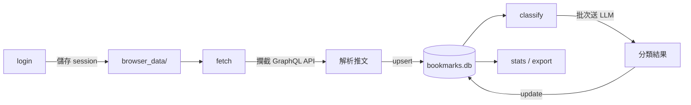
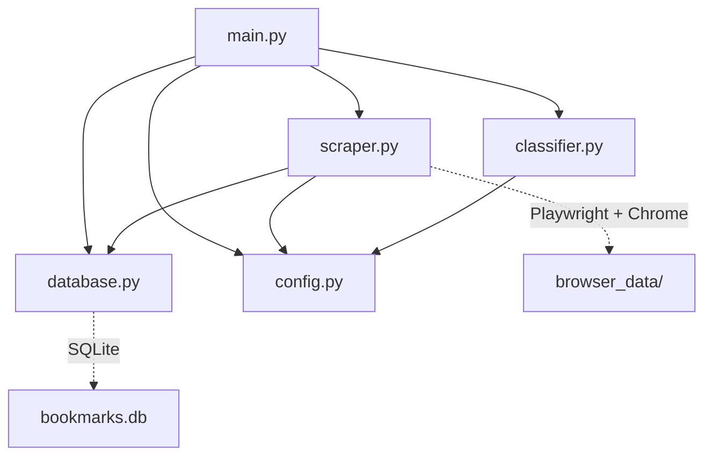

# XBM — X Bookmarks Manager

用 Playwright 瀏覽器自動化抓取 X 書籤，透過 LLM 分類，存入 SQLite。**不需要付費 API**。

## 前置需求

| 項目 | 說明 |
|------|------|
| **Python** | ≥ 3.11 |
| **UV** | [安裝 UV](https://docs.astral.sh/uv/) |
| **Chrome** | 系統需安裝 Google Chrome（Playwright 透過 `channel="chrome"` 呼叫） |
| **LLM** | 本地 Qwen3.5 server 或任何 OpenAI 相容 API |

## 安裝

```bash
cd XBM
uv sync
```

> **Note**: 本專案使用系統已安裝的 Chrome 瀏覽器（非 Playwright 內建 Chromium），無需額外安裝瀏覽器。

## 設定

```bash
cp .env.example .env
# 如需修改 LLM 或 DB 路徑，編輯 .env
```

### 環境變數

| 變數 | 預設值 | 說明 |
|------|--------|------|
| `LLM_BASE_URL` | `http://ai-srv:8090/v1` | LLM API 端點 |
| `LLM_API_KEY` | `not-needed` | API 金鑰（本地模型可忽略） |
| `LLM_MODEL` | `qwen3.5` | 模型名稱 |
| `DATABASE_PATH` | `bookmarks.db` | SQLite 資料庫路徑 |

## 使用方式

```bash
# 1) 首次使用 — 登入 X（開啟 Chrome 手動登入，完成後關閉瀏覽器）
uv run python main.py login

# 2) 抓取書籤（背景執行，攔截內部 GraphQL API）
uv run python main.py fetch

# 抓取時顯示瀏覽器
uv run python main.py fetch --visible

# 限制抓取數量
uv run python main.py fetch -n 50

# 3) 分類書籤
uv run python main.py classify

# 4) 一鍵完成：抓取 + 分類
uv run python main.py run

# 5) 查看統計
uv run python main.py stats

# 6) 匯出 CSV
uv run python main.py export -o my_bookmarks.csv
```

## 運作原理



1. **登入**: 透過 Chrome 開啟 X 登入頁，手動登入後 session 保存至 `browser_data/`
2. **抓取**: 造訪書籤頁 → 攔截 X 內部 GraphQL API 回應 → 解析結構化推文資料 → 自動捲動載入更多
3. **分類**: 透過 LLM (預設 Qwen3.5) 批次分類推文，每批 15 則
4. **儲存**: 所有資料存入 SQLite，支援 upsert（重複不覆蓋分類）

## 架構

```
XBM/
├── main.py           CLI 入口，定義 login / fetch / classify / run / stats / export 指令
├── scraper.py        Playwright 瀏覽器自動化，攔截 GraphQL 回應抓取書籤
├── classifier.py     LLM 分類引擎（OpenAI 相容 API，批次處理）
├── database.py       SQLite 儲存層（upsert、分類更新、統計、CSV 匯出）
├── config.py         設定載入（透過 python-dotenv 讀取 .env）
├── pyproject.toml    專案定義與依賴
├── .env.example      環境變數範例
└── .gitignore        Git 忽略規則
```

### 模組依賴



## 分類類別

| 類別 | 說明 |
|------|------|
| Tech | 技術、程式、AI |
| Design | 設計、UI/UX |
| Business | 商業、創業、行銷 |
| Life | 生活、思考、個人成長 |
| News | 新聞、時事 |
| Other | 其他 |

> 類別定義在 `config.py` 中，可自訂。

## 資料庫

### Schema

```sql
CREATE TABLE bookmarks (
    id               TEXT PRIMARY KEY,
    text             TEXT NOT NULL,
    author_id        TEXT,
    author_name      TEXT,
    author_username  TEXT,
    created_at       TIMESTAMP,
    url              TEXT,
    category         TEXT DEFAULT 'Other',
    raw_json         TEXT,
    fetched_at       TIMESTAMP DEFAULT CURRENT_TIMESTAMP,
    classified_at    TIMESTAMP
);
```

### 查詢範例

```bash
# 查看 Tech 類別
sqlite3 bookmarks.db "SELECT author_username, substr(text,1,80) FROM bookmarks WHERE category='Tech' LIMIT 10;"

# 各分類統計
sqlite3 bookmarks.db "SELECT category, COUNT(*) FROM bookmarks GROUP BY category;"
```

## 依賴

| 套件 | 用途 |
|------|------|
| `playwright` | 瀏覽器自動化（透過系統 Chrome） |
| `openai` | LLM API 客戶端 |
| `python-dotenv` | 環境變數載入 |
| `rich` | 終端美化輸出 |
